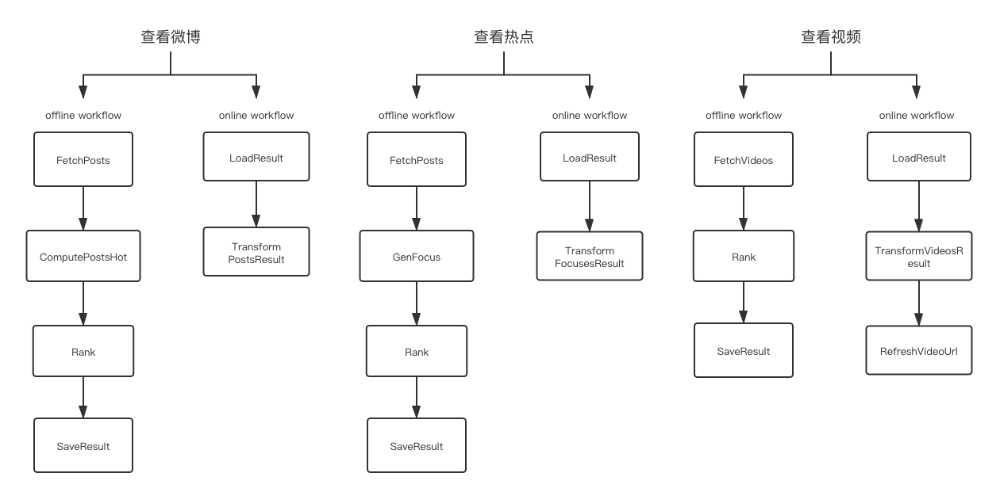

# 音乐热点
- 1. [简介](#1-简介)
- 2. [功能](#2-功能)
	- [查看某个流派下的微博](#21-查看某个流派下的微博)
	- [查看某个流派下的热点](#22-查看某个流派下的热点)
- 3. [设计图](#3-设计图)
- 4. [接口](#4-接口)
	- [获取微博](#41-获取微博)
	- [获取热点](#42-获取热点)
- 5. [启动](#5-启动)
    - [直接启动](#51-直接启动)
    - [容器启动](#52-容器启动)

## 1. 简介
对新浪微博音乐相关微博分析, 形成摇滚、民谣、嘻哈、电子、流行等音乐流派热点

## 2. 功能
### 2.1 查看某个流派下的微博
将某个流派下的所有用户的最新微博收集, 并按热度排序

### 2.2 查看某个流派下的热点
将某个流派下的所有用户的最新微博收集, 生成热点, 并按热度排序

## 3. 设计图


## 4. 接口
### 4.1 获取微博
#### 接口
`GET` `/api/v1/posts`

#### 返回样例
```json
{
  "result": {
    "rock": [
      {
        "id": 1,
        "user_id": 1,
        "user_name": "痛仰乐队",
        "time": "2020-01-24 00:00:00",
        "content": "",
        "share_cnt": 1,
        "comment_cnt": 1,
        "like_cnt": 1,
        "link": "",
        "score": 7000,
        "image_path": "1.png"
      },
      {
        "id": 2,
        "user_id": 2,
        "user_name": "老王乐队",
        "time": "2020-01-25 00:00:00",
        "content": "",
        "share_cnt": 2,
        "comment_cnt": 2,
        "like_cnt": 2,
        "link": "",
        "score": 348680,
        "image_path": "2.png"
      }
    ]
  },
  "status": "OK"
}
```

### 4.2 获取热点
#### 接口
`GET` `/api/v1/focuses`

#### 返回样例
```json
{
  "result": {
    "rock": [
      {
        "title": "#老王乐队发新歌#",
        "description": "",
        "recent_read": 100,
        "read_cnt": 1,
        "discuss_cnt": 1,
        "member_cnt": 1,
        "link": "",
        "related_users": [],
        "score": 100
      },
      {
        "title": "#新裤子乐队巡演#",
        "description": "",
        "recent_read": 200,
        "read_cnt": 2,
        "discuss_cnt": 2,
        "member_cnt": 2,
        "link": "",
        "related_users": [],
        "score": 200
      }
    ]
  },
  "status": "OK"
}
```


## 5. 启动
### 5.1 直接启动
1. 配置环境变量`ROLE`, 选择启动`online`或者`offline`
2. 进入`admin`目录, 执行`sh start.sh`

### 5.2 容器启动
1. 构建镜像, 进入`docker`目录, 执行`sh build.sh`
2. 启动容器, 进入项目根目录, 执行`docker-compose up -d`
